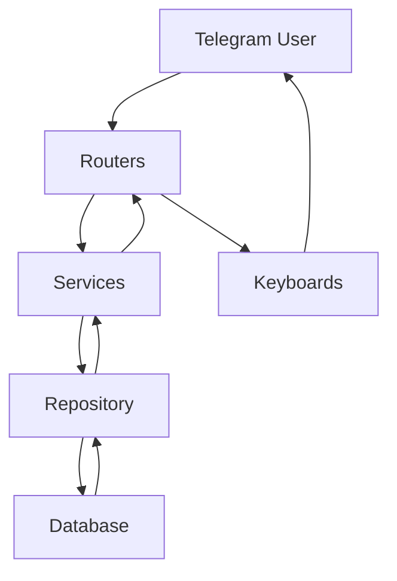

# 💰 SmartSavings - Умные Сбережения

<div align="center">


**Интеллектуальный Telegram-бот для управления личными финансами и аналитики расходов**

[🚀 Быстрый старт](#-быстрый-старт) • [📋 Возможности](#-возможности) • [🏗️ Архитектура](#️-архитектура) • [📖 Документация](#-документация)

</div>

---

## 📖 О проекте

**SmartSavings** — это современный Telegram-бот для управления личными финансами, который помогает отслеживать доходы, расходы и активы. Бот предоставляет удобный интерфейс для ввода финансовых данных, автоматическую аналитику и еженедельные отчеты.

### 🎯 Основные цели проекта

- 📊 **Простота использования** — интуитивный интерфейс через Telegram
- 🔄 **Автоматизация** — еженедельные отчеты и аналитика
- 💱 **Мультивалютность** — поддержка различных валют и криптовалют
- 📈 **Аналитика** — детальная статистика по доходам и расходам
- 🏗️ **Масштабируемость** — модульная архитектура для легкого расширения

---

## ✨ Возможности

### 💳 Управление финансами
- ➕ **Ввод доходов** — быстрое добавление поступлений
- ➖ **Учет расходов** — детальная категоризация трат
- 💎 **Управление активами** — отслеживание инвестиций и сбережений
- 💱 **Мультивалютность** — поддержка USD, EUR, RUB, криптовалют и др.

### 📊 Аналитика и отчеты
- 📈 **Еженедельные отчеты** — автоматическая отправка по понедельникам
- 📋 **Детальная статистика** — анализ по категориям и валютам
- 🎯 **Быстрые команды** — мгновенный доступ к ключевым метрикам
- 📅 **Временные периоды** — анализ за различные интервалы

### 🛠️ Технические возможности
- 🐳 **Docker-контейнеризация** — легкое развертывание
- 🗄️ **SQLite/PostgreSQL** — гибкая работа с БД
- 🔄 **FSM (Finite State Machine)** — умное управление состояниями
- 📱 **Адаптивный UI** — удобные inline-клавиатуры

---

## 🚀 Быстрый старт

### 📋 Предварительные требования

- Python 3.12+
- Telegram Bot Token (получить у [@BotFather](https://t.me/BotFather))
- Docker (опционально)

### ⚡ Установка и запуск

#### 1️⃣ Клонирование репозитория
```bash
git clone https://github.com/your-username/SmartSavings.git
cd SmartSavings
```

#### 2️⃣ Настройка окружения
```bash
# Создайте файл .env
cp .env.example .env

# Отредактируйте .env файл
nano .env
```

**Содержимое `.env`:**
```env
TELEGRAM_BOT_TOKEN=your_bot_token_here
DB_URL=sqlite:///./app/data/app.db
```

#### 3️⃣ Установка зависимостей
```bash
pip install -r requirements.txt
```

#### 4️⃣ Запуск бота
```bash
python -m app.main
```

### 🐳 Запуск через Docker

```bash
# Сборка и запуск
docker-compose up -d

# Просмотр логов
docker-compose logs -f smart_savings_bot
```

---

## 📱 Использование

### 🎮 Основные команды

| Команда | Описание |
|---------|----------|
| `/start` | Запуск бота и главное меню |
| `/help` | Справка по использованию |

### 💰 Работа с финансами

1. **Добавление записи:**
   - Нажмите `/start`
   - Выберите тип: Доход/Расход/Актив
   - Укажите сумму
   - Выберите валюту
   - Выберите категорию
   - Добавьте заметку (опционально)

2. **Просмотр аналитики:**
   - Используйте команды быстрого доступа
   - Просматривайте еженедельные отчеты
   - Анализируйте статистику по категориям

### 📊 Примеры команд

```
/start                    # Главное меню
/expenses_usd            # Расходы в USD
/incomes_eur             # Доходы в EUR
/assets_btc              # Активы в BTC
```

---

## 🏗️ Архитектура

### 📁 Структура проекта

```
SmartSavings/
├── 📱 app/                          # Основное приложение
│   ├── 🚀 main.py                   # Точка входа
│   ├── ⚙️ config.py                 # Конфигурация
│   │
│   ├── 🗄️ db/                       # База данных
│   │   ├── models.py                # SQLAlchemy модели
│   │   └── __init__.py              # Инициализация БД
│   │
│   ├── 🛣️ routers/                  # Обработчики команд
│   │   ├── entries.py               # Ввод данных
│   │   └── analytics/               # Аналитика
│   │       ├── analytics_router.py  # Основная аналитика
│   │       ├── expenses_router.py   # Расходы
│   │       ├── incomes_router.py    # Доходы
│   │       └── asset_router.py      # Активы
│   │
│   ├── 🎯 states/                   # FSM состояния
│   │   └── form.py                  # Состояния форм
│   │
│   ├── ⌨️ keyboards/                 # UI компоненты
│   │   └── form.py                  # Inline клавиатуры
│   │
│   ├── 🏪 repo/                     # Слой данных
│   │   ├── repo.py                  # CRUD операции
│   │   └── entry_fetcher.py         # Получение записей
│   │
│   ├── 🔧 services/                 # Бизнес-логика
│   │   └── analytics/               # Аналитические сервисы
│   │
│   ├── ⏰ scheduler/                # Планировщик задач
│   │   └── scheduler.py             # Cron задачи
│   │
│   ├── 🛠️ utils/                    # Утилиты
│   │   ├── formatting.py            # Форматирование
│   │   ├── date_ranges.py           # Работа с датами
│   │   └── reports.py               # Генерация отчетов
│   │
│   └── 📊 data/                     # Данные
│       └── app.db                   # SQLite база
│
├── 🐳 docker-compose.yml            # Docker конфигурация
├── 🐳 Dockerfile                    # Docker образ
├── 📋 requirements.txt              # Python зависимости
└── 📖 README.md                     # Документация
```

### 🏛️ Архитектурные принципы

#### 🎯 Разделение ответственности

| Слой | Ответственность | Технологии |
|------|----------------|------------|
| **🎮 Routers** | Обработка Telegram команд | aiogram 3.x |
| **🧠 Services** | Бизнес-логика и валидация | Python |
| **🏪 Repository** | Доступ к данным (CRUD) | SQLAlchemy 2.0 |
| **🗄️ Database** | Хранение данных | SQLite/PostgreSQL |
| **🎯 States** | Управление состояниями | aiogram FSM |
| **⌨️ Keyboards** | UI компоненты | InlineKeyboard |

#### 🔄 Поток данных



### 🗄️ Модель данных

#### 👤 User
- `id` — Telegram user ID
- `username` — Telegram username
- `first_seen` — Дата первого использования
- `last_seen` — Дата последнего использования

#### 💱 Currency
- `code` — Код валюты (USD, EUR, BTC, etc.)
- `user_id` — Связь с пользователем

#### 📂 Category
- `mode` — Тип: income/expense/asset
- `name` — Название категории
- `user_id` — Связь с пользователем

#### 📝 Entry
- `mode` — Тип записи: income/expense/asset
- `amount` — Сумма (Decimal)
- `currency_id` — Связь с валютой
- `category_id` — Связь с категорией
- `note` — Заметка
- `created_at` — Дата создания

---

## 🔧 Конфигурация

### 🌍 Переменные окружения

| Переменная | Описание | Пример |
|------------|----------|---------|
| `TELEGRAM_BOT_TOKEN` | Токен Telegram бота | `123456789:ABC...` |
| `DB_URL` | URL базы данных | `sqlite:///./app/data/app.db` |

### ⚙️ Настройки бота

```python
# app/config.py
class Settings(BaseSettings):
    TELEGRAM_BOT_TOKEN: str
    DB_URL: str = "sqlite:///./app/data/app.db"
    
    model_config = SettingsConfigDict(
        env_file=".env",
        extra="ignore"
    )
```

---

## 📊 Мониторинг и логирование

### 📈 Метрики
- Количество активных пользователей
- Объем обработанных транзакций
- Производительность запросов к БД

### 📝 Логирование
```python
import logging

# Настройка логирования
logging.basicConfig(
    level=logging.INFO,
    format='%(asctime)s - %(name)s - %(levelname)s - %(message)s'
)
```

---

## 🧪 Тестирование

### 🏃‍♂️ Запуск тестов
```bash
# Установка тестовых зависимостей
pip install pytest pytest-asyncio

# Запуск тестов
pytest tests/
```

### 📋 Покрытие тестами
```bash
# Установка coverage
pip install coverage

# Запуск с покрытием
coverage run -m pytest
coverage report
coverage html
```

---

## 🚀 Развертывание

### 🐳 Docker Production

```bash
# Сборка образа
docker build -t smartsavings:latest .

# Запуск в production
docker-compose -f docker-compose.prod.yml up -d
```

### ☁️ Облачное развертывание

#### Heroku
```bash
# Установка Heroku CLI
heroku create smartsavings-bot
heroku config:set TELEGRAM_BOT_TOKEN=your_token
git push heroku main
```

#### Railway
```bash
# Подключение к Railway
railway login
railway init
railway up
```

---

## 🤝 Вклад в проект

### 🔀 Workflow разработки

1. **Fork** репозитория
2. **Создайте** feature branch (`git checkout -b feature/amazing-feature`)
3. **Commit** изменения (`git commit -m 'Add amazing feature'`)
4. **Push** в branch (`git push origin feature/amazing-feature`)
5. **Откройте** Pull Request

### 📝 Стандарты кода

```bash
# Форматирование кода
black app/
isort app/

# Проверка типов
mypy app/

# Линтинг
flake8 app/
```

### 🧪 Тестирование изменений

```bash
# Запуск всех тестов
pytest

# Тесты с покрытием
pytest --cov=app

# Проверка безопасности
bandit -r app/
```

---

## 📚 Документация

### 🔗 Полезные ссылки

- [📖 aiogram 3.x Documentation](https://docs.aiogram.dev/)
- [🗄️ SQLAlchemy 2.0 Documentation](https://docs.sqlalchemy.org/)
- [🐳 Docker Documentation](https://docs.docker.com/)
- [📱 Telegram Bot API](https://core.telegram.org/bots/api)

### 📋 API Reference

#### 🛣️ Routers
- `entries.py` — Обработка ввода финансовых данных
- `analytics_router.py` — Основная аналитика
- `expenses_router.py` — Анализ расходов
- `incomes_router.py` — Анализ доходов
- `asset_router.py` — Управление активами

#### 🏪 Repository
- `repo.py` — CRUD операции для всех моделей
- `entry_fetcher.py` — Специализированные запросы для записей

#### 🧠 Services
- `expense_reports.py` — Генерация отчетов по расходам

---

## 🐛 Известные проблемы

### ⚠️ Текущие ограничения

- [ ] Поддержка только SQLite в development режиме
- [ ] Ограниченная валидация валютных курсов
- [ ] Нет экспорта данных в CSV/Excel

### 🔧 Планируемые улучшения

- [ ] 📊 Расширенная аналитика с графиками
- [ ] 🔄 Синхронизация с банковскими API
- [ ] 🤖 AI-ассистент для финансовых советов

---

## 📄 Лицензия

Этот проект распространяется под лицензией MIT. См. файл [LICENSE](LICENSE) для подробностей.

---

## 👨‍💻 Автор

**Bogdan Shevchenko**
- GitHub: [@bsshevchenko](https://github.com/bsshevchenko)
- Telegram: [@bsshevchenko](https://t.me/bsshevchenko)

---

## 🙏 Благодарности


---

<div align="center">

**⭐ Если проект был полезен, поставьте звезду!**

[🐛 Сообщить об ошибке](https://github.com/your-username/SmartSavings/issues) • [💡 Предложить улучшение](https://github.com/your-username/SmartSavings/issues) • [📖 Документация](https://github.com/your-username/SmartSavings/wiki)

</div>